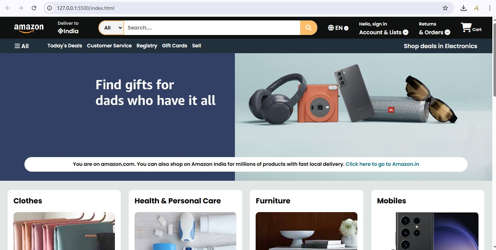
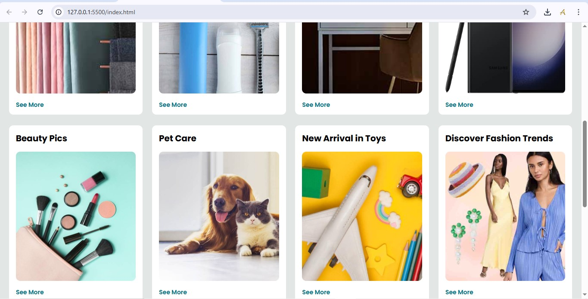
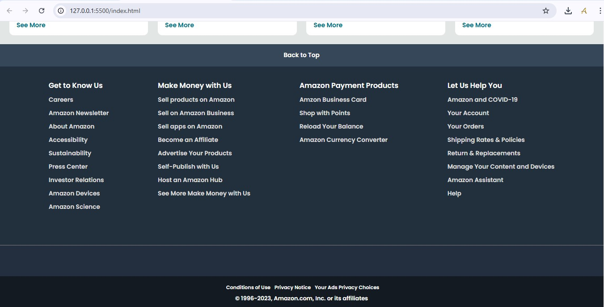

# 🛒 Amazon Clone UI

This project is a frontend-only clone of the Amazon India homepage built using **HTML**, **CSS**, and **JavaScript**. It replicates the core layout and design of the Amazon user interface, including a responsive header, product sections, footer, and other components.

## 🔧 Features

- ✅ Fully responsive layout
- 🧭 Sticky navigation bar with search and cart
- 📦 Product cards with hover effects
- 📱 Mobile-friendly design using Flexbox/Grid
- 🎨 Clean and modern UI inspired by Amazon

## 📁 Folder Structure
```
Amazon-Clone-UI/
│
├── index.html # Main HTML file
├── /css # Stylesheets
│ └── style.css
├── /js # JavaScript files (if any)
│ └── script.js
├── /images # Assets and product images
├── /screenshots # UI screenshots for README
│ ├── screenshot1.png
│ ├── screenshot2.png
│ └── screenshot3.png
└── README.md # Project documentation
```
## 🚀 Getting Started

To view the project locally:

1. Clone the repository:
   ```bash
   git clone https://github.com/Asish7980/Amazon-Clone-UI.git
Open index.html in your browser.

No backend or API functionality is included—this is a static UI clone for learning or demonstration purposes.

## Here is a breakdown of the different sections in the code:
```
1. Header:
* Contains the Amazon logo, delivery address, search bar, language selection, sign-in information, and cart icon.

2. Bottom Panel:
* ntains links to different sections such as Today's Deals, Customer Service, Registry, Gift Cards, and Sell.

3. Heor Section:
* Display a message witha link to the Amazon India website.

4. Shop Section:
* Displays different product categories with images and "See More" links.

5. Footer:
* Contains multiple sections with links to various pages and information about Amazon.
```
## 📸 Screenshots

### 🧭 Header


### 🛍️ Shop Section


### 🔻 Footer



# 🛠️ Technologies Used
```
HTML5

CSS3

JavaScript (for dynamic parts)

Flexbox & Grid Layout
```
# 📚 Learning Purpose
```
This project was built as part of a Frontend Development Practice and to better understand responsive layouts and UI cloning techniques.
```
# 📩 Feedback or Contributions
```
Feel free to fork, improve, or give feedback by opening issues or pull requests.
```
# © 2025 Asish Shaw
